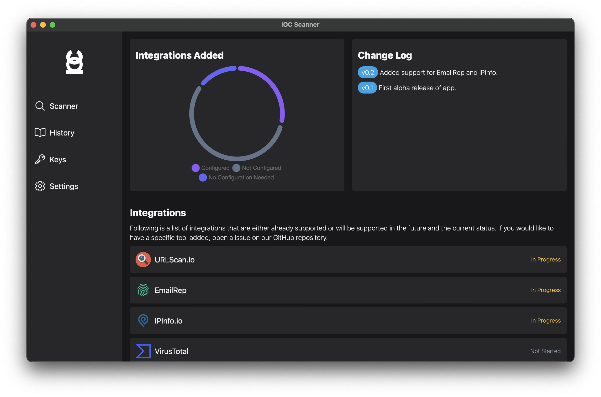

# IOC-Scanner



This app lets you scan an IOCs (Indicator of Compromise) on multiple different pages at once and shows you a summary of all the results. 

The goal of this project is to have a native app that allows you to quickly see important informations from different pages like VirusTotla, UrlScan, DomainTools, ... and give you an overview of the results from each of the tools. 

Written in Rust for speed and with a Svelte frontend this app runs on Linux, Windows, & MacOS. 

## Support the Project

If you would like to support this project but don't necessarily know how to write code, you can fuel faster code by buying a coffee. 🥰☕️

[](https://ko-fi.com/D1D3GCTJP)

## Developing

To run the project you need to have npm and cargo, then just run this command in the root folder of the project:


```bash
cargo tauri dev
```

The app will automatically update the UI whenever you make any changes to the code, so you won't have to rerun this command after each change.

## Roadmap

The goal for this app is to have the following integrations:

- [ ] URLScan.io
- [ ] VirusTotal 
- [x] IPInfo.io
- [ ] IPLocation.net
- [ ] AbuseIPDB
- [ ] EmailRep.io
- [ ] HaveIBeenPwned
